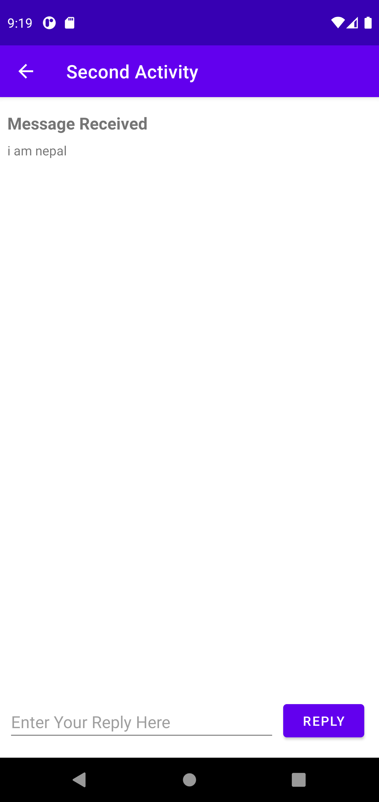

# Lab-5-TwoActivities-LifeCycles

## TwoActivities Application Overview

- Application MainActivity Index

- Application SecondActivity Index

## TwoActivities Application Log Workings

- logcat MainActivity

- logcat SecondActivity

# Shopping-app Challenge

## Shopping-List Overview

- Application Shopping List Index 

## Shopping-List Application Workings

- Add item Button 

# Counter Homework

## Counter Homework Overview

- Application Index 

## Counter Homework Application Workings

- Application working

